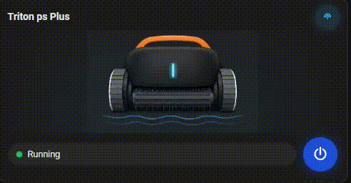
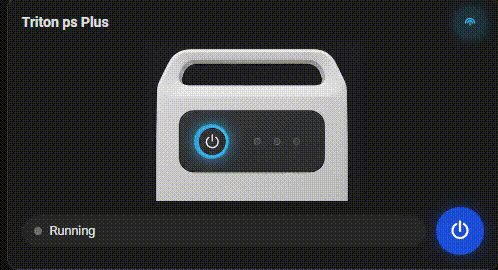

# Pool Cleaner Card

Lovelace card for the **[Maytronics Dolphin](https://github.com/randrcomputers/ha-maytronics-dolphin)** integration — power toggle, status, BLE icon, optional blue LED pulse on your robot artwork, and PSU button ring — using images from **`/local/`**.

## Previews

| Cleaner (running) | Power supply |
| :---: | :---: |
|  |  |

Your own card images (`robot` / `psu` URLs in the editor) can be **PNG, JPEG, WebP**, or **GIF** if you prefer.

## Install

1. **HACS** → **Frontend** → **Custom repositories** → add `https://github.com/randrcomputers/ha-pool-cleaner-card`
2. **Frontend** → **Pool Cleaner Card** → **Download**
3. **Settings** → **Dashboards** → **⋮** → **Reload resources**, then refresh the browser (**Ctrl+F5**)

## Pictures on Home Assistant

Optional artwork shipped in this repo: copy the files from **`pool_card/`** into **`config/www/pool_card/`** on Home Assistant.

| File to copy (`pool_card/` → `www/pool_card/`) | Example URL |
| --- | --- |
| `robot_triton_front.png` | `/local/pool_card/robot_triton_front.png` |
| `psu_front.png` | `/local/pool_card/psu_front.png` |

Enter those URLs in **Robot image URL** / **Power supply image URL**, or YAML:

```yaml
type: custom:pool-cleaner-card
device: YOUR_DEVICE_ID
image_robot: /local/pool_card/robot_triton_front.png
image_psu: /local/pool_card/psu_front.png
```
```
image_robot: /local/pool_card/robot_triton_front.png
image_psu: /local/pool_card/psu_front.png
robot_led_top: 32
robot_led_left: 48
robot_led_width: 5
robot_led_height: 15.5
robot_led_radius: 8
robot_led_brightness: 155
psu_ring_cx: 33
psu_ring_cy: 59
psu_ring_size: 14.5
show_cleaner_when: auto
type: custom:pool-cleaner-card
entity_power: switch.triton_ps_plus_power
device: 2c1eb24c0f60efdee0d33f6d19c14549
entity_state: sensor.triton_ps_plus_cleaner_state
entity_cleaning: binary_sensor.triton_ps_plus_cleaning_active
entity_connected: binary_sensor.triton_ps_plus_ps_state_data_ok
art_style: classic
```

Use your own images if you prefer (PNG, JPEG, WebP, or GIF paths work).
Use the UI and pick your **Dolphin device**, or YAML:

```yaml
type: custom:pool-cleaner-card
device: YOUR_DEVICE_ID
```

---

**Requirements:** Home Assistant 2024.1+ and the Maytronics Dolphin BLE integration.


